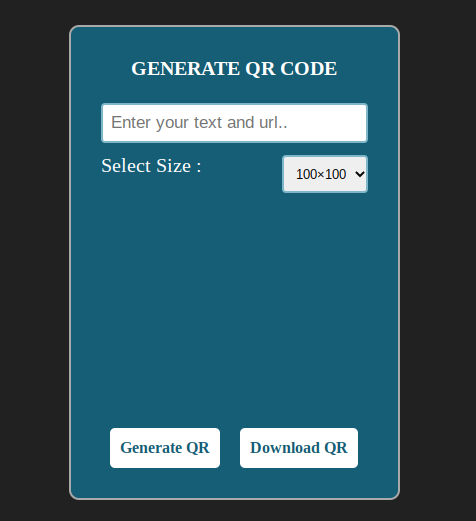

# 📱 QR Code Generator

This is a **QR Code Generator Web Application** built using **HTML**, **CSS**, and **JavaScript**.  
It allows users to generate QR codes instantly by entering any text, link, or data. The app also lets users **download the QR code image** to their device for sharing or future use.

---

## ✨ Features

- ✅ Generate QR codes in real-time
- ✅ Supports text, URLs, and other data formats
- ✅ Responsive & clean user interface
- ✅ Instant QR code preview
- ✅ **Download** QR code as an image
- ✅ Input validation with error handling

---

## 🛠️ Technologies Used

- **HTML** – for structure  
- **CSS** – for styling and responsiveness  
- **JavaScript** – to handle QR code generation  
- **[qrcode.js](https://davidshimjs.github.io/qrcodejs/)** – JavaScript library used for generating QR codes

---

## 📸 Screenshots

### 🖥️ Desktop View

---

### 📱 Mobile View

---

## 👨‍💻 Author

**Sonu Yadav**  
📷 [Instagram: @CodeWithSonu](https://www.instagram.com/CodeWithSonu)

---

